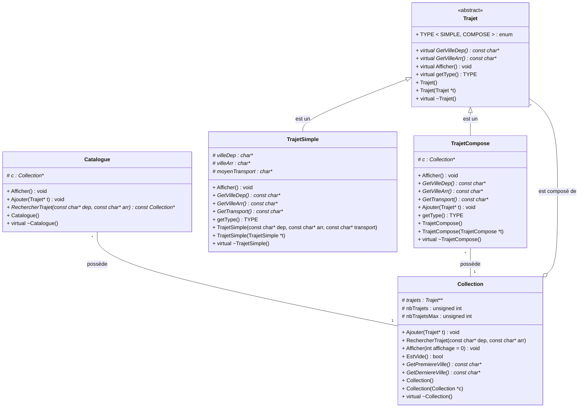

# **Diagramme de classes**  

```mermaid
classDiagram
    class Catalogue {
        # c : Collection**

        + Afficher() void
        + Ajouter(Trajet* t) void
        + RechercherTrajet(const char* dep, const char* arr) const Collection**
        
        + Catalogue()
        + virtual ~Catalogue()
    }

    class Collection {
        # trajets : Trajet***
        # nbTrajets : unsigned int
        # nbTrajetsMax : unsigned int
              
        + Ajouter(Trajet* t) void
        + RechercherTrajet(const char* dep, const char* arr) 
        + Afficher(int affichage = 0) void
        + EstVide() bool
        + GetPremiereVille() const char**
        + GetDerniereVille() const char**

        + Collection()
        + Collection (Collection *c)
        + virtual ~Collection()
    }

    class Trajet {
        <<abstract>>
        + TYPE ~ SIMPLE, COMPOSE ~ : enum 

        + virtual GetVilleDep() const char**
        + virtual GetVilleArr() const char**
        + virtual Afficher() void
        + virtual getType() TYPE

        + Trajet()
        + Trajet( Trajet *t )
        + virtual ~Trajet()
    }

    class TrajetSimple {
        # villeDep : char** 
        # villeArr : char**
        # moyenTransport : char**

        + Afficher() void
        + GetVilleDep() const char**
        + GetVilleArr() const char**
        + GetTransport() const char**
        + getType() TYPE

        + TrajetSimple(const char* dep, const char* arr, const char* transport)
        + TrajetSimple(TrajetSimple *t)
        + virtual ~TrajetSimple()
    }

    class TrajetCompose {
        # c : Collection**

        + Afficher() void
        + GetVilleDep() const char**
        + GetVilleArr() const char**
        + GetTransport() const char**
        + Ajouter(Trajet* t) void
        + getType() TYPE

        + TrajetCompose()
        + TrajetCompose(TrajetCompose *t)
        + virtual ~TrajetCompose()
    }

    Catalogue "*" -- "1" Collection : possède
    TrajetCompose "*" -- "1" Collection : possède
    Trajet "*" --o Collection : est composé de
    Trajet <|-- TrajetSimple : est un
    Trajet <|-- TrajetCompose : est un
```
